# TP Aspire, Blazor, OIDC

## Prérequis

- [.NET 9 SDK](https://dotnet.microsoft.com/en-us/download)
- Installez les templates Aspire :
  ```sh
  dotnet new install Aspire.ProjectTemplates
  ```
- [Bruno](https://www.usebruno.com/) (pour tester les APIs)
- [Docker Desktop](https://www.docker.com/products/docker-desktop/) (pour
  Keycloak et SQL Server)

## Objectifs du TP

À la fin de ce TP, vous serez capables de :

- Créer une solution Aspire complète.
- Ajouter et configurer une API .NET Core avec EF Core et SQL Server.
- Créer une application Blazor Server qui consomme l’API.
- Mettre en place l’authentification OIDC avec Keycloak.
- Protéger les accès à l’API et à l’application Blazor.

## Pourquoi utiliser Aspire ?

Aspire est une plateforme d'orchestration et d'observabilité pour les
applications .NET modernes, conçue pour faciliter le développement, le
déploiement et la supervision d'architectures distribuées (microservices, APIs,
webapps, bases de données, etc.).

**Principaux avantages :**

- **Orchestration locale simplifiée** : Aspire permet de lancer et de superviser
  plusieurs services (API, web, bases de données, conteneurs, etc.) en une seule
  commande, sans avoir à gérer manuellement chaque composant.
- **Observabilité intégrée** : Aspire propose un dashboard centralisé pour
  visualiser l'état des services, les logs, la santé, les métriques et les
  dépendances entre composants.
- **Configuration centralisée** : Les connexions entre services (ex : API ↔ base
  de données) sont gérées automatiquement, ce qui réduit les erreurs de
  configuration.
- **Expérience développeur améliorée** : Aspire accélère la mise en place
  d'environnements de développement proches de la production, tout en restant
  simple à utiliser.

> Vous pourrez illustrer cette section avec des captures d'écran du dashboard
> Aspire, de la vue des logs, ou de la cartographie des dépendances.

## Rôle de l'AppHost et du ServiceDefaults

- **AppHost** : C'est le projet d'orchestration Aspire. Il sert à démarrer,
  superviser et configurer tous les services de votre solution (API, web, bases
  de données, conteneurs, etc.). C'est depuis l'AppHost que vous lancez
  l'ensemble de votre environnement applicatif en une seule commande. Il permet
  aussi d'accéder au dashboard Aspire pour l'observabilité et la gestion des
  dépendances.

- **ServiceDefaults** : Ce projet contient des extensions et des configurations
  partagées (par exemple, la configuration de la journalisation, de la santé, de
  la télémétrie, etc.) qui sont appliquées à tous les services de la solution.
  Cela permet d'assurer une cohérence et de centraliser les bonnes pratiques de
  configuration pour tous vos microservices .NET.

## 1. Mise en place de la solution Aspire

> **Remarque :** Dans toutes les commandes et noms de projets, remplacez `MyApp`
> par le nom que vous souhaitez donner à votre application.

### 1.1 Création de la solution et des projets

1. Créez la solution Aspire (cela va générer le dossier, le .sln, l'AppHost et
   le ServiceDefaults) :

   ```sh
   dotnet new aspire -n MyApp
   ```

   [Doc officielle](https://learn.microsoft.com/en-us/dotnet/aspire/get-started/)

2. Vérifiez que la solution contient bien les projets `MyApp.AppHost` et
   `MyApp.ServiceDefaults`.

## 2. Création de l’API

### 2.1 Création et configuration du projet API

1. Créez le projet API :

   ```sh
   dotnet new webapi -n MyApp.ApiService
   dotnet sln add MyApp.ApiService/MyApp.ApiService.csproj
   ```

2. Ajoutez la référence à ServiceDefaults :

   ```sh
   dotnet add MyApp.ApiService/MyApp.ApiService.csproj reference MyApp.ServiceDefaults/MyApp.ServiceDefaults.csproj
   ```

3. Dans `MyApp.ApiService/Program.cs`, ajoutez :

   ```csharp
   builder.AddServiceDefaults();
   ```

4. Ajoutez l’API à l’AppHost (dans `MyApp.AppHost/Program.cs`). Exemple:
   ```csharp
   // ...existing code...
   builder.AddProject<Projects.MyApp_ApiService>("apiservice");
   // ...existing code...
   ```

### 2.2 Ajout d'un endpoint avec Minimal API

1. Dans `MyApp.ApiService/Program.cs`, ajoutez un endpoint Minimal API :

   ```csharp
   app.MapGet("/api/todo", () => new[] { "Tâche 1", "Tâche 2" });
   ```

2. Dans Bruno, créer une nouvelle collection

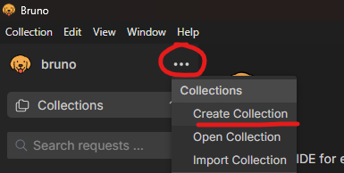

3. Ajouter une requête GET vers `http://localhost:xxxx/api/todo` (remplacez
   `xxxx` par le port de l’API, visible dans la console Aspire). Testez la et constatez le retour OK.

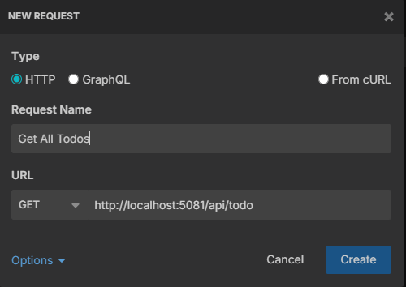
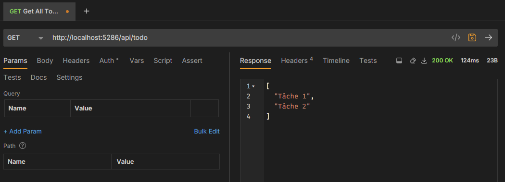

## 3. Ajout d’une base de données SQL Server avec EF Core

### 3.1 Ajout du conteneur SQL Server dans l’AppHost

1. Ajoutez la ressource SQL Server dans `MyApp.AppHost/Program.cs` :
   ```csharp
   var sql = builder.AddSqlServer("sql");

   builder.AddProject<Projects.MyApp_ApiService>("apiservice")
       .WithReference(sql)
       .AddDatabase("myapp");
   
   builder.AddProject<Projects.MyApp_ApiService>("apiservice")
       .WithReference(database)
       .WaitFor(database);
   ```
   [Doc Aspire SQL Server](https://learn.microsoft.com/en-us/dotnet/aspire/components/sql-server/)

On crée d'abord le serveur de base de données, puis on crée une base de données dans ce serveur (ici nommée "myapp").
L'API est configurée pour se connecter à cette base via la référence au conteneur SQL Server.

Ensuite, on référence la base de données dans l'API et on attend que la base soit prête avant de démarrer l'API. Quand
on lance la solution, on constate que la variable d'environnement `ConnectionStrings__myapp` est automatiquement
injectée dans l'API avec la bonne chaîne de connexion.


2. Seed la database
   Pour éviter de réinstancier la base de données à chaque fois, vous pouvez ajouter un seed dans le projet API. On
   commence par utiliser un volume pour sauvegarder la base de données sur le disque. Puis on ajoute un script
   d'initialisation de la dabase.

```csharp
var sqlserver = builder.AddSqlServer("sqlserver")
    // Configure the container to store data in a volume so that it persists across instances.
    .WithDataVolume()
    // Keep the container running between app host sessions.
    .WithLifetime(ContainerLifetime.Persistent);

// Add the database to the application model so that it can be referenced by other resources.
var initScriptPath = Path.Join(Path.GetDirectoryName(typeof(Program).Assembly.Location), "init.sql");
var database = sqlserver.AddDatabase("myapp")
    .WithCreationScript(File.ReadAllText(initScriptPath));
```

Une autre méthode consiste à ajouter un seed dans le projet API via EF Core. La méthode est décrite dans la
documentation
officielle : [Seed data using EF Core](https://learn.microsoft.com/en-us/dotnet/aspire/database/seed-database-data?tabs=sql-server#seed-data-using-ef-core).

### 3.2 Création du projet de persistance et ajout du modèle

Pour bien séparer notre application, nous allons créer un projet de persistance pour gérer les entités et le DbContext.

1. Créez un projet de bibliothèque de classes pour la persistance :
   ```sh
   dotnet new classlib -n MyApp.Persistence
   dotnet sln add MyApp.Persistence/MyApp.Persistence.csproj
   ```

2. Ajoutez le package EF Core dans ce projet :
   ```sh
   dotnet add MyApp.Persistence package Microsoft.EntityFrameworkCore.SqlServer
   ```

3. Dans `MyApp.Persistence`, ajoutez le DbContext et une première entité (par exemple, `TodoItem`) :
   ```csharp
   // TodoItem.cs
   public class TodoItem
   {
       public int Id { get; set; }
       public string Title { get; set; }
   }

   // MyAppDbContext.cs
   using Microsoft.EntityFrameworkCore;
   public class MyAppContext(DbContextOptions<MyAppContext> options) : DbContext(options)
   {
       public DbSet<TodoItem> TodoItems { get; set; }
       public MyDbContext(DbContextOptions<MyDbContext> options) : base(options) { }
   }
   ```

Ensuite on décrit cette table en utilisation un `IEntityTypeConfiguration<TEntity>` pour séparer la configuration du
modèle de l'entité elle-même.

```csharp
// TodoItemConfiguration.cs
public class TodoItemConfiguration : IEntityTypeConfiguration<TodoItem>
{
    public void Configure(EntityTypeBuilder<TodoItem> builder)
    {
        builder.ToTable("T_TodoItems");
        builder.HasKey(t => t.Id);
        builder.Property(t => t.Title).IsRequired().HasMaxLength(200);
    }
}
```

Enfin on référence cette configuration dans le DbContext :

```csharp
protected override void OnModelCreating(ModelBuilder modelBuilder)
{
    new TodoItemConfiguration().Configure(modelBuilder.Entity<TodoItem>());
    base.OnModelCreating(modelBuilder);
}
```

4. Dans le projet API, ajoutez une référence à la couche de persistance, et l'intégration Aspire EF Core :
   ```sh
   dotnet add MyApp.ApiService/MyApp.ApiService.csproj reference MyApp.Persistence/MyApp.Persistence.csproj
    dotnet add MyApp.ApiService package Aspire.Microsoft.EntityFrameworkCore.SqlServer
   ```

5. Dans `MyApp.ApiService/Program.cs`, configurez le DbContext (en important le namespace du projet Persistence) :
   ```csharp
   using MyApp.Persistence;
   // ...existing code...
   builder.AddSqlServerDbContext<MyAppDbContext>(connectionName: "myapp");
   // ...existing code...
   ```

L'intégration est décrite dans la
documentation [Aspire Azure SQL Entity Framework Core integration](https://learn.microsoft.com/en-us/dotnet/aspire/database/azure-sql-entity-framework-integration/)

6. Ajoutez les endpoints Minimal API dans l’API pour manipuler les TodoItems :
   ```csharp
   app.MapGet("/api/todo", async (MyDbContext db) => await db.TodoItems.ToListAsync());
   app.MapPost("/api/todo", async (TodoItem item, MyDbContext db) =>
   {
       db.TodoItems.Add(item);
       await db.SaveChangesAsync();
       return Results.Created($"/api/todo/{item.Id}", item);
   });
   ```

9. Testez les endpoints avec Bruno (GET et POST). Puis vérifiez que les données sont bien persistées dans la base SQL
   Server, avec DBeaver par exemple.

## 4. Création du client Blazor Server

Pour ce TP nous utiliserons Blazor Server (uniquement en SSR) pour simplifier par la suite la configuration OIDC. Pour
le mode de rendu auto, il faut rajouter du code pour passer le contexte d'authentification entre le client et le
serveur.

### 4.1 Création et configuration du projet Blazor

1. Créez le projet Blazor Server :

   ```sh
   dotnet new blazorserver -n MyApp.WebApp
   dotnet sln add MyApp.WebApp/MyApp.WebApp.csproj
   ```

2. Ajoutez la référence à ServiceDefaults :

   ```sh
   dotnet add MyApp.WebApp/MyApp.WebApp.csproj reference MyApp.ServiceDefaults/MyApp.ServiceDefaults.csproj
   ```

   Dans le `Program.cs` de Blazor, ajoutez :
   ```csharp
   builder.AddServiceDefaults();
   ```

3. Ajoutez le projet Blazor à l’AppHost et référencez l’API:

   Dans `MyApp.AppHost/Program.cs`, ajoutez :

    ```csharp
    builder.AddProject<Projects.MyApp_WebApp>("webapp")
        .WithReference(apiService);
        .WaitFor(apiService);
    ```

4. Création d'un client HTTP typé

Pour consommer l'API depuis Blazor, nous allons créer un client HTTP typé.

- Créez un dossier `Clients` dans le projet Blazor.
- Ajoutez une interface `ITodoClient` :
    ```csharp
    public interface ITodoClient
    {
        Task<List<TodoItem>> GetTodoItemsAsync();
        Task<TodoItem> CreateTodoItemAsync(TodoItem item);
    }
    ```
- Ajoutez une implémentation `TodoClient` :
    ```csharp
    public class TodoClient : ITodoClient
    {
        private readonly HttpClient _httpClient;
        public TodoClient(HttpClient httpClient)
        {
            _httpClient = httpClient;
        }
        public async Task<List<TodoItem>> GetTodoItemsAsync()
        {
            return await _httpClient.GetFromJsonAsync<List<TodoItem>>("/api/todo");
        }
        public async Task<TodoItem> CreateTodoItemAsync(TodoItem item)
        {
            var response = await _httpClient.PostAsJsonAsync("/api/todo", item);
            response.EnsureSuccessStatusCode();
            return await response.Content.ReadFromJsonAsync<TodoItem>();
        }
    }
    ```
- Dans `Program.cs` de Blazor, enregistrez le client HTTP typé :
    ```csharp
    builder.Services.AddHttpClient<ITodoClient, TodoClient>(client =>
    {
        client.BaseAddress = new Uri("https+http://apiservice"); 
    });
    ```
  Note : `https+http://apiservice` est le nom du service API dans Aspire, qui sera résolu automatiquement par
  le [service discovery](https://learn.microsoft.com/en-us/dotnet/aspire/service-discovery/overview).

5. Création d'une nouvelle page Blazor pour afficher des données

Créez une nouvelle page blazor `Pages/Todo.razor`.

On commence par injecter le client `ITodoClient`, et définir l'url de la page.

```razorhtmldialect
@page "/todos"
@using MyApp.WebApp.Clients
@inject ITodoClient httpClient
```

Cela va nous permettre de l'utiliser dans la partie code.

Ensuite, dans la partie code on crée une liste pour stocker les tâches.

```csharp
@code {

    private List<TodoItem>? todos = null;

    protected override async Task OnInitializedAsync()
    {
        todos = await httpClient.GetTodoItemsAsync();
    }
}
```

Enfin, on affiche la liste des tâches dans la partie HTML. Avec un fallback tant que la liste n'est pas encore chargée.

```csharp
<h3>Todos</h3>

@if (todos == null)
{
    <p>Loading ...</p>
}
else
{
    <ul>
        @foreach (var todo in todos)
        {
            <li>@todo.Title</li>
        }
    </ul>
}
```

En lancant l'application, vous devriez voir les données qui remontent de votre API. Dans la console Aspire, vous pouvez
voir les appels entre le client Blazor et l'API, dans la section "Traces".

### 4.2 Ajout d’un formulaire pour créer des TodoItems

On commence par créer un composant blazor, `Components/AddTodoForm.razor` :

```razorhtmldialect

<form method="post" @onsubmit="Submit" @formname="add-todo-item-form">
    <AntiforgeryToken/>
    <h4>Add a new todo</h4>
    <div class="mb-3">
        <label for="todoItem" class="form-label">Title</label>
        <InputText type="text" class="form-control" id="todoItem" placeholder="Enter todo item"
                   @bind-Value="Model!.Title" required/>
    </div>
    <button type="submit" class="btn btn-primary">Add Title</button>
</form>
```

Plusieurs choses a noter :

- On utilise le composant `InputText` de Blazor pour le champ de saisie, ca permettra de bénéficier de la liaison de
  données et de la validation intégrée.
- On utilise l'événement `onsubmit` pour gérer la soumission du formulaire.
- On ajoute un token antiforgery pour la sécurité.
- On ajoute un attribut `formname` pour identifier le formulaire facon unique.

Pour pouvoir utiliser l'antiforgery token, il faut ajouter le service dans `Program.cs` ainsi que le middleware :

```csharp
builder.Services.AddAntiforgery();
// ...
app.UseAntiforgery();
```

Ensuite on ajoute l'import du namespace des composants blazor dans le fichier d'imports `_Imports.razor` :

```csharp
@using Microsoft.AspNetCore.Components.Forms;
```

Puis on ajoute la partie code dans le composant `AddTodoForm.razor` :

```csharp
@code {
    [SupplyParameterFromForm]
    private TodoFormItem? Model { get; set; }

    protected override void OnInitialized()
    {
        Model ??= new TodoFormItem();
    }

    private async Task Submit()
    {
        if (Model is not null)
        {
            await Client.CreateTodoItemAsync(new TodoItem()
            {
                Id = 0,
                Title = Model.Title,
            });
        }
    }
    public class TodoFormItem
    {
        public string Title { get; set; } = string.Empty;
    }
}
```

Le composant utilise un modèle `TodoFormItem` pour lier les données du formulaire. Lors de la soumission, il appelle le
client HTTP pour créer un nouvel élément Todo.

Enfin, on intègre ce composant dans la page `Pages/Todo.razor`, juste au dessus de la liste des tâches :

```razor
<AddTodoForm />
```

### 4.3 Mise à jour de la liste après ajout

On peut désormais ajouter des tâches via le formulaire. Cependant, la liste ne se met pas à jour automatiquement. Pour
cela, on va utiliser un `EventCallback` pour notifier la page parente lorsque une tâche est ajoutée.

On commence par modifier le composant `AddTodoForm.razor` pour ajouter un `EventCallback` :

```diff
@code {
    [SupplyParameterFromForm]
    private TodoFormItem? Model { get; set; }

+    [Parameter]
+    public EventCallback OnTodoAdded { get; set; }
```

Le callback est décoré par l'attribut `[Parameter]` pour indiquer qu'il peut être passé depuis un composant ou une page
parente.

Ensuite, dans la méthode `Submit`, on invoque le callback après avoir ajouté la tâche :

```diff
    private async Task Submit()
    {
        if (Model is not null)
        {
            await Client.CreateTodoItemAsync(new TodoItem()
            {
                Id = 0,
                Title = Model.Title,
            });
+           await OnTodoAdded.InvokeAsync();
        }
    }
``` 

Enfin, dans la page `Pages/Todo.razor`, on passe une méthode au callback pour recharger la liste des tâches :

```razor
<AddTodoForm OnTodoAdded="LoadTodos" />

@code {
    private List<TodoItem>? todos = null;

    protected override async Task OnInitializedAsync()
    {
        await LoadTodos();
    }
    private async Task LoadTodos()
    {
        todos = await httpClient.GetTodoItemsAsync();
    }
}
```

### 4.4 Validation

Pour ajouter de la validation au formulaire, il existe plusieurs méthodes qui sont documentées dans
la [doc officielle](https://learn.microsoft.com/en-us/aspnet/core/blazor/forms/validation).
Par exemple, em utilisant un `ValidationMessageStore`, un `EditContext`, et l'évènement `OnValidationRequested` :

```csharp
@using MyApp.WebApp.Clients
@inject ITodoClient Client

<EditForm EditContext="editContext" OnValidSubmit="Submit" FormName="add-todo-item-form">
    <h4>Add a new todo</h4>
    <div class="mb-3">
        <label for="todoItem" class="form-label">Title</label>
        <InputText type="text" class="form-control" id="todoItem" placeholder="Enter todo item" @bind-Value="Model!.Title" required/>
    </div>
    
    <div>
        <ValidationMessage For="() => Model!.Title" />
    </div>
    
    <button type="submit" class="btn btn-primary">Add Title</button>
</EditForm>

@code {
    [SupplyParameterFromForm]
    private TodoFormItem? Model { get; set; }

    private EditContext? editContext;
    private ValidationMessageStore? messageStore;

    [Parameter]
    public EventCallback OnTodoAdded { get; set; }

    protected override void OnInitialized()
    {
        Model ??= new TodoFormItem();
        editContext = new EditContext(Model);
        editContext.OnValidationRequested += HandleValidationRequested;
        messageStore = new ValidationMessageStore(editContext);
    }
    
    private void HandleValidationRequested(object? sender,
        ValidationRequestedEventArgs args)
    {
        messageStore?.Clear();

        // Custom validation logic
        if (string.IsNullOrWhiteSpace(Model!.Title))
        {
            messageStore?.Add(() => Model.Title, "Title is required.");
        }

        if (Model.Title.Length > 100)
        {
            messageStore?.Add(() => Model.Title, "Title cannot exceed 100 characters.");
        }
    }


    private async Task Submit()
    {
        if (Model is not null)
        {
            await Client.CreateTodoItemAsync(new TodoItem()
            {
                Id = 0,
                Title = Model.Title,
            });
            await OnTodoAdded.InvokeAsync();
            Model = new TodoFormItem(); // reset le formulaire
        }
    }
    public class TodoFormItem
    {
        public string Title { get; set; } = string.Empty;
    }
}
```

⚠️ L'antiforgery token est automatiquement géré par le composant `EditForm`.

## 5. OpenId Connect (OIDC) avec Keycloak

### Qu'est-ce qu'OpenID Connect (OIDC) ?

OpenID Connect (OIDC) est un protocole d'authentification moderne basé sur OAuth 2.0. Il permet à une application (le
client, ici notre front Blazor) de vérifier l'identité d'un utilisateur auprès d'un fournisseur d'identité (Identity
Provider, ou IdP) et d'obtenir des informations sur cet utilisateur de façon sécurisée, via des jetons (tokens).

OIDC est largement utilisé pour l'authentification unique (SSO) et la délégation d'identité dans les applications web et
mobiles.

### Qu'est-ce que Keycloak ?

Keycloak est une solution open source de gestion des identités et des accès (IAM). Il permet de gérer les utilisateurs,
les rôles, les clients (applications), et de fournir des services d'authentification et d'autorisation centralisés pour
vos applications. Keycloak supporte OIDC, OAuth2 et SAML.

Dans ce TP, Keycloak jouera le rôle de fournisseur d'identité (IdP) OIDC.

### Stratégie d'authentification et d'autorisation dans ce TP

- **Pour le front Blazor** :
    - Nous utiliserons le flow OIDC "Authorization Code" avec PKCE (Proof Key for Code Exchange). Ce flow est recommandé
      pour les applications web côté client car il est sécurisé et évite l'exposition du secret client.
    - L'utilisateur s'authentifie auprès de Keycloak, qui renvoie un code d'autorisation, puis un access token et un ID
      token.

- **Pour l'API** :
    - L'API sera protégée par un middleware JWT Bearer. Elle acceptera uniquement les requêtes contenant un access token
      valide émis par Keycloak.
    - Le front Blazor utilisera l'access token de l'utilisateur connecté pour s'autoriser auprès de l'API. Ainsi, chaque
      appel API depuis le front sera authentifié et autorisé selon les droits de l'utilisateur.

### 5.1 Ajout d’un conteneur Keycloak dans l’AppHost

L'intégration de Keycloak dans Aspire est encore en préversion. Il faut donc ajouter le package avec le flag
`--prerelease` :

```sh
dotnet add MyApp.AppHost package Aspire.Hosting.Keycloak  --prerelease
```

1. Ajoutez le conteneur dans `MyApp.AppHost/Program.cs` :

```csharp
var keycloack = builder.AddKeycloak("keycloak", 8090)
    .WithDataVolume()
    .WithLifetime(ContainerLifetime.Persistent)
```

[Doc Aspire Keycloak integration](https://learn.microsoft.com/en-us/dotnet/aspire/authentication/keycloak-integration)

On va également référencer Keycloak dans l’API et le front Blazor, pour qu’ils puissent communiquer avec le serveur
d’authentification, de la meme maniere que pour la database.

#### Configuration du realm dans Keycloak

Avant de configurer nos applications, nous allons préparer le terrain en configurant tout ce dont nous avons besoin dans
Keycloak.
Dans la console Aspire, récupérer le login et mot de passe admin de Keycloak (généré automatiquement au premier
démarrage).

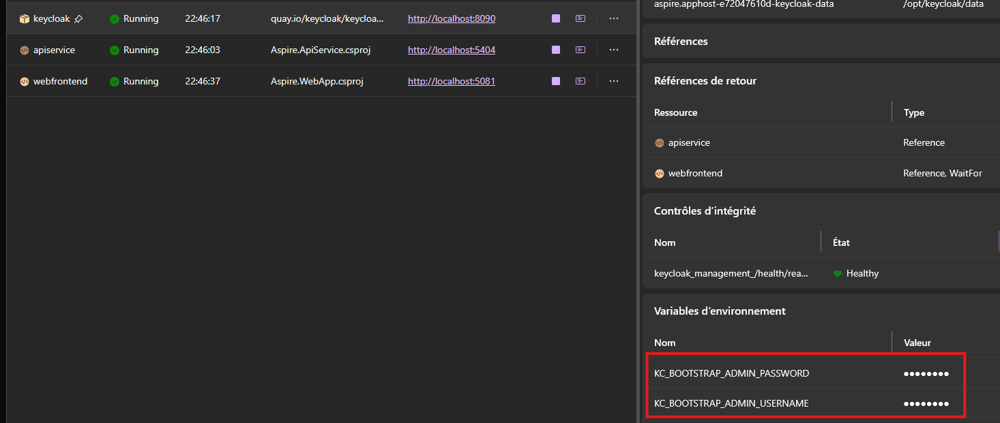

Avec ces identifiants, connectez-vous à l’interface d’administration de Keycloak. L’URL est visible dans la console
Aspire. La première chose a faire est de créer un realm. Keycloak utilise des realms pour isoler les configurations et
les utilisateurs (par exemple Decathlon France et Decathlon Brésil sont deux tenants différents, avec chacun leur
realm). Un realm peut contenir plusieurs clients (applications) et utilisateurs. Nommez le realm du nom de votre
application.

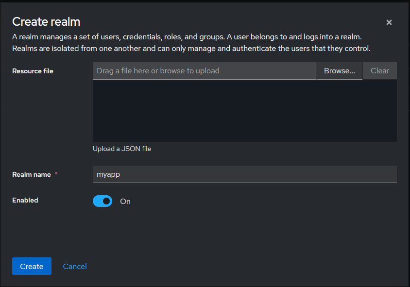

#### Création d’un client OIDC de test pour notre API

Dans la page **client**, créez un nouveau client appelé "api-test". Configurez le client comme suit :
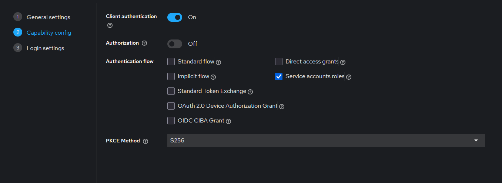

Ne remplissez pas les autres champs pour l’instant. Cliquez sur **Save**.

Ensuite, dans Client Scopes, créez un nouveau scope appelé `api`. Il va nous servir à associer l'audience et les roles
de notre API.
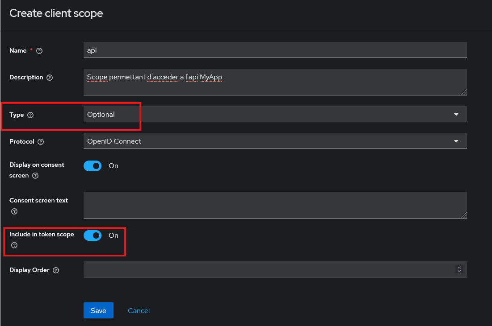

Dans les mappers du scope, ajoutez un mapper de type "Audience" pour inclure l’audience dans le token JWT : Add Mapper >
By Configuration > Audience
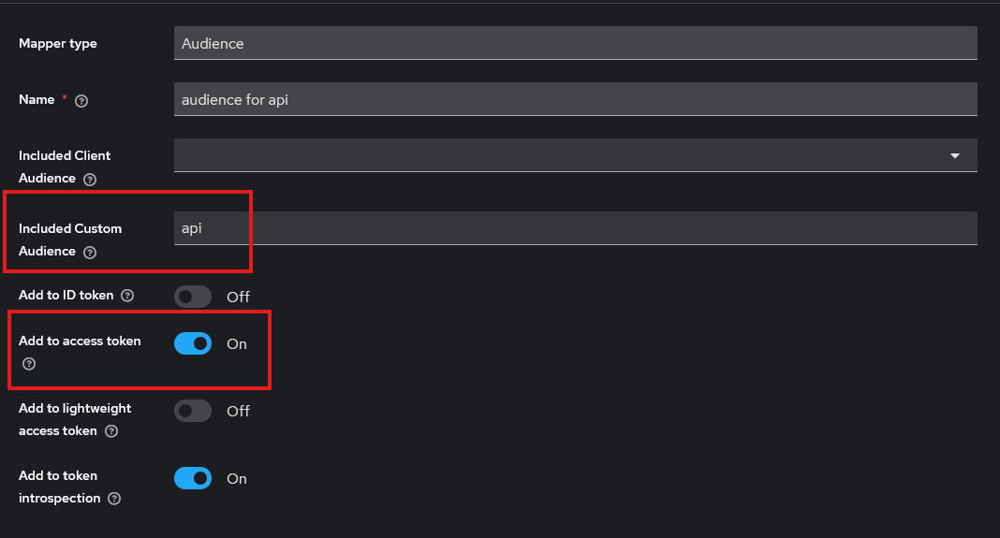

Enfin, dans le scope `roles`, en page 2, on va modifier le mapper `realm roles` pour qu’il soit inclus dans le token
d’accès (Access Token) et dans l’ID Token.
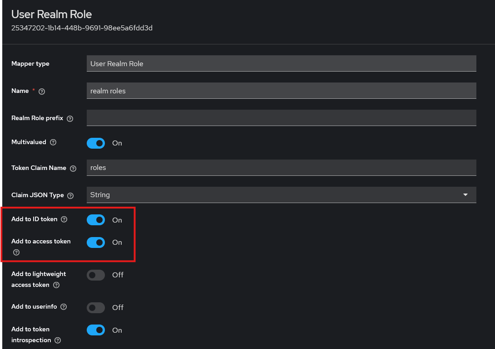

Pour finir, on ajoute le scope `api` a notre client `api-test`.

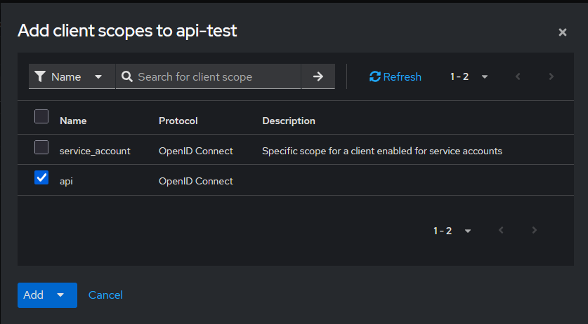

##### Scope et Audience en OAuth 2.0

En OAuth 2.0 (et OIDC), les notions de scope et d’audience sont fondamentales pour la sécurité et la gestion des accès :

###### Scope

Un **scope** (périmètre) est une chaîne de caractères qui définit les permissions ou les ressources auxquelles le client
souhaite accéder au nom de l’utilisateur. Lorsqu’une application demande un jeton d’accès, elle précise les scopes
désirés. Par exemple :

- `openid` (pour OIDC)
- `profile`, `email` (accès aux infos de profil)
- `api.read`, `api.write` (accès en lecture/écriture à une API)

Le serveur d’autorisation (ex : Keycloak) valide ces scopes et les encode dans le jeton d’accès si l’utilisateur y
consent. L’API peut ensuite vérifier que le scope requis est bien présent dans le jeton avant d’autoriser l’accès à une
ressource.

###### Audience

L’**audience** (aud, pour “audience”) est un champ du jeton d’accès qui indique à quel service ou API ce jeton est
destiné. C’est une mesure de sécurité importante : une API doit toujours vérifier que le jeton qu’elle reçoit lui est
bien destiné, en contrôlant la valeur de l’audience.

- Exemple : si une API s’appelle `myapi`, le champ `aud` du jeton doit contenir `myapi`.
- Si le jeton est destiné à une autre API, il ne doit pas être accepté.

**Résumé** :

- Le **scope** précise “ce que le client veut faire” (permissions).
- L’**audience** précise “pour qui est ce jeton” (quelle API/service doit l’accepter).

Cela permet de limiter les droits accordés et d’éviter qu’un jeton soit utilisé sur une API pour laquelle il n’a pas été
émis.

#### Roles

Pour distinguer les droits de nos utilisateurs, on va également créer dans **Realm roles** un role "gestionnaire" pour
donner les droits en écrire dans notre API.
Puis on va créer plusieurs utilisateurs et ajouter le role de gestionnaire a certains. Pour vous faciliter la vie dans
le TP, utiliser le login en tant que mot de passe.

### 5.2 Protection JWT côté API

On va maintenant protéger notre API par JWT. Nos utilisateurs devront ajouter un `access_token` valide venant de notre
IdP.

1. Ajoutez le package :
   ```sh
   dotnet add MyApp.ApiService package Microsoft.AspNetCore.Authentication.JwtBearer
   ```
2. Dans `Program.cs` de l’API, configurez l’authentification :

```csharp

builder.Services.AddAuthentication(JwtBearerDefaults.AuthenticationScheme)
    .AddJwtBearer(JwtBearerDefaults.AuthenticationScheme, options =>
    {
        options.Authority = builder.Configuration["Authentication:OIDC:Authority"];
        options.Audience = builder.Configuration["Authentication:OIDC:Audience"];
        options.RequireHttpsMetadata = false;
        options.TokenValidationParameters = new TokenValidationParameters
        {
            ValidateAudience = true,
            ValidateIssuer = true,
            ValidateLifetime = true,
            ValidateIssuerSigningKey = true,
            NameClaimType = "name",
            RoleClaimType = "role",
        };
        options.MapInboundClaims = false;
    });

builder.Services.AddAuthorization();

//...

app.UseAuthentication();
app.UseAuthorization();

```

Pensez a mettre la configuration dans votre fichier `appsettings.json` pour l'authority et l'audience. L'authority est
au format `http://localhost:8090/realms/myapp` et l'audience a le nom défini plus tot lors de la création mapping dans
le scope.

3. Protégez les endpoints avec `[Authorize]`.
   [Doc officielle](https://learn.microsoft.com/en-us/azure/active-directory/develop/scenario-protected-web-api-overview)

Par exemple :

```csharp
app.MapGet("/api/todo", [Authorize] async (MyAppContext db) => await db.TodoItems.ToListAsync());
```

En testant dans bruno, on voit que l'endpoint retourne désormais une 401. Pour palier a cela, on va aller s'authentifier
auprès de l'IdP pour récupérer un jeton.
Au niveau de la collection, on configure l'authentification.

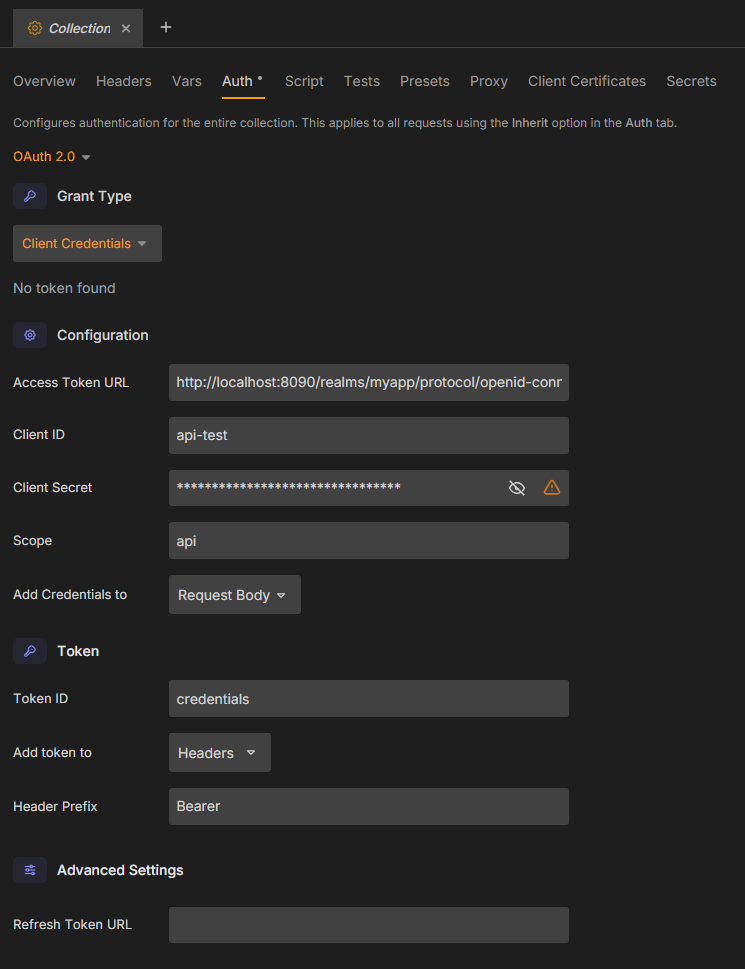

Pour l'access token URL, elle se trouve dans le document `.well-known/openid-configuration` de votre realm, dans la clé
`token_endpoint`. Par exemple : http://localhost:8090/realms/myapp/.well-known/openid-configuration.
Le client secret a été automatiquement généré dans keycloak, lors de la création du client de test plus tot.

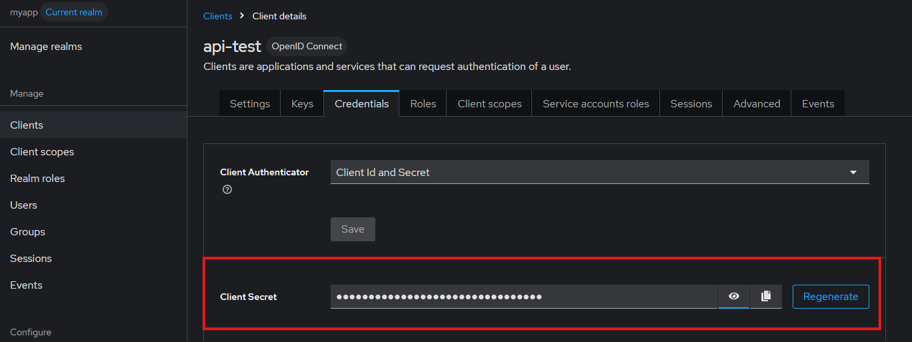

En cliquant sur Get Access Token, on obtient maintenant un `access_token` qui sera automatiquement envoyé a notre API
via un header, au format `Authorization: Bearer <jwt>`.
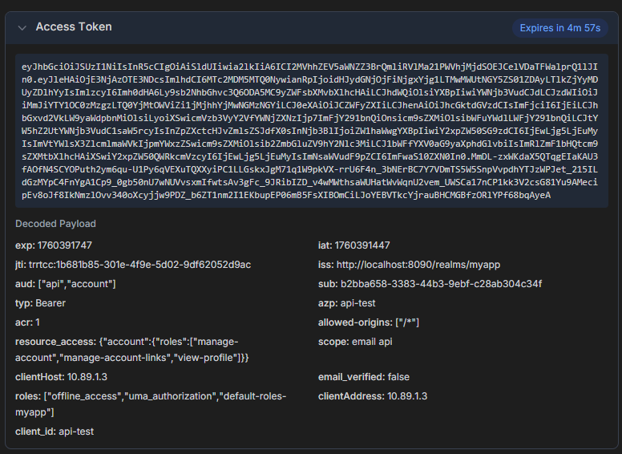

### 5.3 Authentification OIDC côté Blazor


Dans notre application Blazor, on va authentifier des utilisateurs. On va donc passer dans un flow **Authorization Code
**. Nos utilisateurs seront redirigés vers la mire de connexion de notre IDP quand ils cliqueront sur login. Ensuite,
ses informations seront stockées dans un cookie chiffré.

#### Création du client Authorization Code dans Keycloak

Dans la page **client**, créez un nouveau client appelé "blazor-client". Configurez le client comme suit (en utilisant bien les ports de votre application Blazor) :

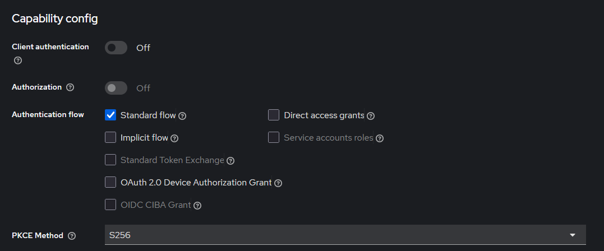

Pensez à ajouter le scope `api` a ce client également.


1. Ajoutez le package OpenId Connect :
   ```sh
   dotnet add MyApp.WebApp package Microsoft.AspNetCore.Authentication.OpenIdConnect
   ```
2. Dans `Program.cs` de Blazor, configurez l’authentification :

```csharp
builder.Services.AddAuthentication(options =>
{
    options.DefaultScheme = CookieAuthenticationDefaults.AuthenticationScheme;
    options.DefaultChallengeScheme = "oidc";
})
.AddCookie(CookieAuthenticationDefaults.AuthenticationScheme)
.AddOpenIdConnect("oidc", options =>
{
    options.Authority = builder.Configuration["Authentication:OIDC:Authority"]; // la meme que pour l'API
    options.ClientId = builder.Configuration["Authentication:OIDC:ClientId"]; // le nom du client crée juste avant dans keycloak
    options.RequireHttpsMetadata = false;
    options.ResponseType = "code";
    options.SaveTokens = true;
    options.SignInScheme = CookieAuthenticationDefaults.AuthenticationScheme;
    options.CallbackPath = "/signin-oidc";
    options.SignedOutCallbackPath = "/signout-callback-oidc";
    options.UseTokenLifetime = true;
    options.MapInboundClaims = false;
    options.Scope.Add("api");
    options.TokenValidationParameters = new TokenValidationParameters()
    {
        NameClaimType = "name", // Par défaut, le nom et le role sont mappés sur ces claims avec des noms différents
        RoleClaimType = "role",
    };
    options.ClaimActions.MapAll();
});
```

3. Gestion des refresh tokens

Pour s'assurer de renouveller nos tokens de maniere transparente une fois qu'ils sont expirés, on doit mettre un peu de
code complexe dans notre app:

```csharp
//CookieOidcRefresher.cs
internal sealed class CookieOidcRefresher(IOptionsMonitor<OpenIdConnectOptions> oidcOptionsMonitor)
{
    private readonly OpenIdConnectProtocolValidator oidcTokenValidator = new()
    {
        // We no longer have the original nonce cookie which is deleted at the end of the authorization code flow having served its purpose.
        // Even if we had the nonce, it's likely expired. It's not intended for refresh requests. Otherwise, we'd use oidcOptions.ProtocolValidator.
        RequireNonce = false,
    };

    public async Task ValidateOrRefreshCookieAsync(CookieValidatePrincipalContext validateContext, string oidcScheme)
    {
        var accessTokenExpirationText = validateContext.Properties.GetTokenValue("expires_at");
        if (!DateTimeOffset.TryParse(accessTokenExpirationText, out var accessTokenExpiration))
        {
            return;
        }

        var oidcOptions = oidcOptionsMonitor.Get(oidcScheme);
        var now = oidcOptions.TimeProvider!.GetUtcNow();
        if (now + TimeSpan.FromMinutes(5) < accessTokenExpiration)
        {
            return;
        }

        var oidcConfiguration = await oidcOptions.ConfigurationManager!.GetConfigurationAsync(validateContext.HttpContext.RequestAborted);
        var tokenEndpoint = oidcConfiguration.TokenEndpoint ?? throw new InvalidOperationException("Cannot refresh cookie. TokenEndpoint missing!");

        using var refreshResponse = await oidcOptions.Backchannel.PostAsync(tokenEndpoint,
            new FormUrlEncodedContent(new Dictionary<string, string?>()
            {
                ["grant_type"] = "refresh_token",
                ["client_id"] = oidcOptions.ClientId,
                ["client_secret"] = oidcOptions.ClientSecret,
                ["scope"] = string.Join(" ", oidcOptions.Scope),
                ["refresh_token"] = validateContext.Properties.GetTokenValue("refresh_token"),
            }));

        if (!refreshResponse.IsSuccessStatusCode)
        {
            validateContext.RejectPrincipal();
            return;
        }

        var refreshJson = await refreshResponse.Content.ReadAsStringAsync();
        var message = new OpenIdConnectMessage(refreshJson);

        var validationParameters = oidcOptions.TokenValidationParameters.Clone();
        if (oidcOptions.ConfigurationManager is BaseConfigurationManager baseConfigurationManager)
        {
            validationParameters.ConfigurationManager = baseConfigurationManager;
        }
        else
        {
            validationParameters.ValidIssuer = oidcConfiguration.Issuer;
            validationParameters.IssuerSigningKeys = oidcConfiguration.SigningKeys;
        }

        var validationResult = await oidcOptions.TokenHandler.ValidateTokenAsync(message.IdToken, validationParameters);

        if (!validationResult.IsValid)
        {
            validateContext.RejectPrincipal();
            return;
        }

        var validatedIdToken = JwtSecurityTokenConverter.Convert(validationResult.SecurityToken as JsonWebToken);
        validatedIdToken.Payload["nonce"] = null;
        oidcTokenValidator.ValidateTokenResponse(new()
        {
            ProtocolMessage = message,
            ClientId = oidcOptions.ClientId,
            ValidatedIdToken = validatedIdToken,
        });

        validateContext.ShouldRenew = true;
        validateContext.ReplacePrincipal(new ClaimsPrincipal(validationResult.ClaimsIdentity));

        var expiresIn = int.Parse(message.ExpiresIn, NumberStyles.Integer, CultureInfo.InvariantCulture);
        var expiresAt = now + TimeSpan.FromSeconds(expiresIn);
        validateContext.Properties.StoreTokens([
            new() { Name = "access_token", Value = message.AccessToken },
            new() { Name = "id_token", Value = message.IdToken },
            new() { Name = "refresh_token", Value = message.RefreshToken },
            new() { Name = "token_type", Value = message.TokenType },
            new() { Name = "expires_at", Value = expiresAt.ToString("o", CultureInfo.InvariantCulture) },
        ]);
    }
}
```

```csharp
internal static class CookieOidcServiceCollectionExtensions
{
    public static IServiceCollection ConfigureCookieOidc(this IServiceCollection services, string cookieScheme, string oidcScheme)
    {
        services.AddSingleton<CookieOidcRefresher>();
        services.AddOptions<CookieAuthenticationOptions>(cookieScheme).Configure<CookieOidcRefresher>((cookieOptions, refresher) =>
        {
            cookieOptions.Events.OnValidatePrincipal = context => refresher.ValidateOrRefreshCookieAsync(context, oidcScheme);
        });
        services.AddOptions<OpenIdConnectOptions>(oidcScheme).Configure(oidcOptions =>
        {
            // Request a refresh_token.
            oidcOptions.Scope.Add(OpenIdConnectScope.OfflineAccess);
            // Store the refresh_token.
            oidcOptions.SaveTokens = true;
        });
        return services;
    }
}
```

```csharp
//Program.cs
builder.Services.ConfigureCookieOidc(CookieAuthenticationDefaults.AuthenticationScheme, "oidc");
```

4. Ajout de la redirection pour les pages protégées

Si un utilisateur anonyme essaie d'arriver sur une page protégée, on veut le rediriger vers l'écran de login.

```razorhtmldialect
//Routes.razor
@using Microsoft.AspNetCore.Components.Authorization
<Router AppAssembly="typeof(Program).Assembly">
    <Found Context="routeData">
        <AuthorizeRouteView RouteData="routeData" DefaultLayout="typeof(Layout.MainLayout)">
            <NotAuthorized>
                <RedirectToLogin/>
            </NotAuthorized>
        </AuthorizeRouteView>
        <FocusOnNavigate RouteData="routeData" Selector="h1"/>
    </Found>
</Router>
```

```csharp
// Components/RedirectToLogin.razor
@inject NavigationManager Navigation

@code {
    protected override void OnInitialized()
    {
        Navigation.NavigateTo($"authentication/login?returnUrl={Uri.EscapeDataString(Navigation.Uri)}", forceLoad: true);
    }
}
```

On utilise `AuthorizeRouteView` dans le router pour gérer le cas `NotAuthorized`. Des explications sont disponibles dans
la [documentation blazor sur la sécurité](https://learn.microsoft.com/en-us/aspnet/core/blazor/security). Le composant
`RedirectToLogin` rediregera l'utilisateur sur l'url `authentication/login`, qui est par défaut celle qui démarre le
parcours d'authentification.

5. Proteger une page

En ajoutant `@attribute [Authorize]` en haut d'une page, votre utilisateur devra etre authentifié pour accéder a la
page. S'il doit avoir un role précis, on peut écrire : `@attribute [Authorize(Roles = "gestionnaire")]` par exemple.

6. S'authentifier auprès de l'API

Pour passer l'access_token de notre utilisateur a notre API, on va créer un `Handler` pour notre HttpClient. Un handler
est une classe qui vient ajouter de la logique a un `HttpClient`, a la maniere d'un middleware. La documentation
explique ca [ici](https://learn.microsoft.com/en-us/aspnet/web-api/overview/advanced/httpclient-message-handlers).

```csharp
public class TokenHandler(IHttpContextAccessor httpContextAccessor) : 
    DelegatingHandler
{
    protected override async Task<HttpResponseMessage> SendAsync(
        HttpRequestMessage request, CancellationToken cancellationToken)
    {
        if (httpContextAccessor.HttpContext is null)
        {
            throw new Exception("HttpContext not available");
        }

        var accessToken = await httpContextAccessor.HttpContext
            .GetTokenAsync("access_token");

        request.Headers.Authorization =
            new AuthenticationHeaderValue("Bearer", accessToken);

        return await base.SendAsync(request, cancellationToken);
    }
}
```

Ensuite on enregistre ce handler aupres de notre Client :

```csharp
// Program.cs
builder.Services.AddHttpClient<ITodoClient, TodoClient>(client =>
{
    client.BaseAddress = new Uri("https+http://apiservice");
}).AddHttpMessageHandler<TokenHandler>();
```

### Fonctionnalités réservées à certains utilisateurs

En se basant sur ce qui a été vu, et sur les documentations officielles, créer une fonctionnalité qui ne sera disponible
uniquement que pour les utilisateurs ayant un role dans l'IdP.


